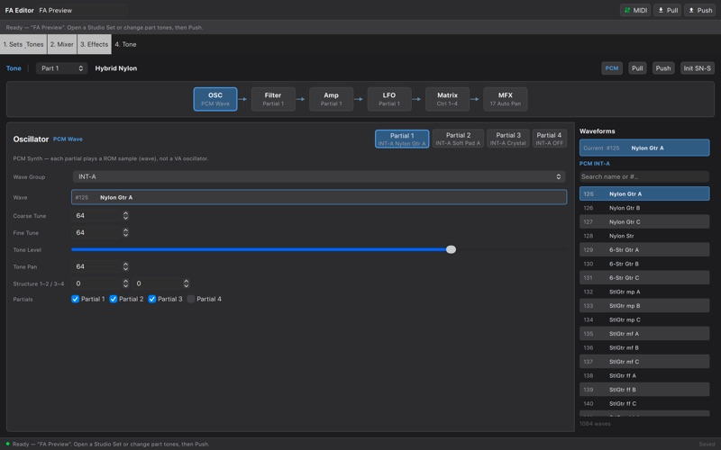
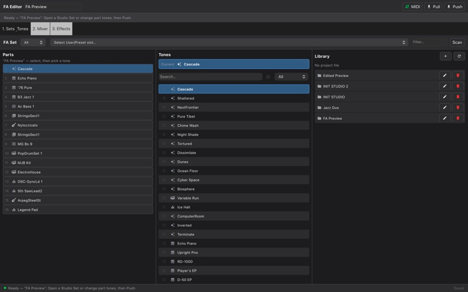
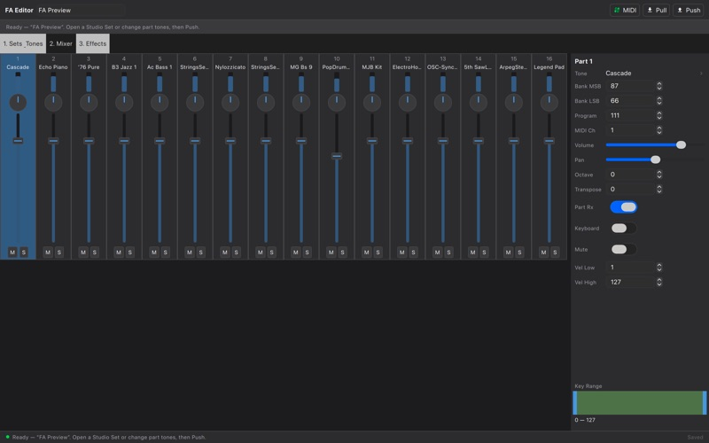
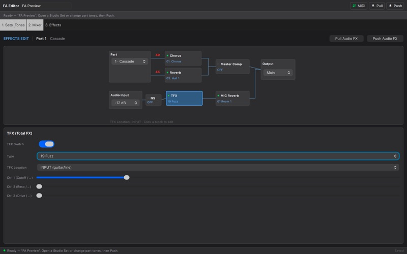

# FA Editor

macOS Studio Set and Temporary Tone editor for Roland FA-06 / FA-07 / FA-08.

Qt 6.11 QML UI + C++ models/controllers over documented Roland SysEx.

## Mac App Store

A signed binary is available as **[Editor for Roland FA](https://apps.apple.com/fi/app/editor-for-roland-fa/id6794627204?mt=12)** on the Mac App Store (**USD $9.99** / local currency). Source in this repository remains free under MIT for building yourself.

<p>
  
  
</p>
<p>
  
  
</p>

## Requirements

- macOS
- CMake ≥ 3.21
- Qt 6.11.1 at `/Volumes/Datastore/Qt/6.11.1/macos` (override with `CMAKE_PREFIX_PATH`)
- Xcode command-line tools
- Network once (Fetches [RtMidi](https://github.com/thestk/rtmidi))

## Build

The `FAEDITOR_PRODUCT` CMake cache option selects `FA` or `FANTOM` and defaults to `FA`.
The default command and target remain unchanged:

```bash
cmake -S . -B build -DCMAKE_PREFIX_PATH=/Volumes/Datastore/Qt/6.11.1/macos
cmake --build build -j
ctest --test-dir build --output-on-failure
open build/FAEditor.app
```

Build the separate Fantom shell with:

```bash
cmake -S . -B build-fantom -DFAEDITOR_PRODUCT=FANTOM -DCMAKE_PREFIX_PATH=/Volumes/Datastore/Qt/6.11.1/macos
cmake --build build-fantom -j
ctest --test-dir build-fantom --output-on-failure
open build-fantom/FantomEditor.app
```

The Fantom product currently provides its own workflow shell and selects the safe
Fantom capability profile. Device-specific editing is not implemented and it sends
no guessed MIDI or SysEx.

## Usage

1. On the FA: System → USB Driver → **Vendor (MIDI+Audio)**; install Roland USB driver if needed.
2. In the app: **MIDI → Auto-connect FA** (or pick ports — skip DAW CTRL).
3. Tab **1. Sets & Tones**: pick a User/Preset slot from the **FA Set** dropdown (top bar) to recall it, select a part (left), click a tone to assign (right; icon previews). Optional **Scan** for User names. Local projects are in the **Library** tab.
4. **Mixer**, **Effects**, and **Tone** edit Temporary data on the FA. **Push Temp** for a full Temporary rewrite. To keep a **User** slot permanently, use **Write** on the FA itself (SysEx only edits Temporary).

## Layout

- `src/app/` — product controllers (`AppController` for FA, safe `FantomAppController` shell)
- `src/platform/` — shared capability boundary and verified/skeleton device adapters
- `src/model/`, `src/project/`, `src/undo/` — reusable model, local-backup/library, and undo primitives
- `qml/components/`, `qml/theme/` — shared Logic-inspired controls and theme
- `qml/Main.qml`, `qml/FantomMain.qml` — separate product workflows selected by CMake
- `resources/tones/soundlist.json` — FA-06/07/08 preset tone catalog from Roland Sound List (`scripts/import_soundlist.py`)
- `resources/waves/waveforms.json` — waveform name catalog (`scripts/import_waveforms.py`)
- `roland_specs/` — official PDFs (reference only)
- [`docs/svd-format.md`](docs/svd-format.md) — experimental SVD1/MI73 container and packed-tone research notes

## Notes

Headless tests use `FakeInstrumentPlatform`; they never require MIDI hardware. Run them with
`ctest --test-dir build --output-on-failure`. The fake stores tone sections per part and can
inject deterministic connection/timeout-style failures.

- Unofficial third-party tool — not affiliated with Roland Corporation.
- Device editing uses documented SysEx. Experimental offline SVD1 research is
  isolated and must validate complete parameter schemas before enabling device writes.
- FA exposes Studio Set *data* only as Temporary (`18 00 00 00`); User/Preset slots are recalled via Setup Bank Select (`01 00 00 04`).

## Privacy

See [`PRIVACY.md`](PRIVACY.md). The app does not collect personal data.

## License

FA Editor source code is licensed under the **MIT License** — see [`LICENSE`](LICENSE).

Third-party components (Qt, RtMidi, Font Awesome Free, Material Icons, and
Roland reference documentation) are attributed in
[`THIRD_PARTY_NOTICES.md`](THIRD_PARTY_NOTICES.md).
