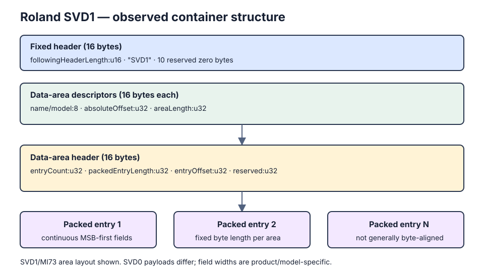

# Roland SVD1 research notes

This document records reverse-engineering observations used to develop offline
Roland FA backup import. It is not an official Roland file-format specification.
All multi-byte integers observed in the FA sample are big-endian.



## Container layout

The observed file starts with a 16-byte fixed header:

| Offset | Size | Meaning |
| --- | ---: | --- |
| `0x00` | 2 | Length of the bytes following this field up to the first data area |
| `0x02` | 4 | ASCII magic `SVD1` |
| `0x06` | 10 | Zero/reserved bytes |

The first data area therefore starts at `2 + headerLength`. The number of
16-byte data-area descriptors is `(2 + headerLength - 16) / 16`. Each descriptor
contains an 8-byte area identifier, a 4-byte absolute file offset, and a 4-byte
area length.

In the tested SVD1/MI73 file, each data area starts with another 16-byte header:

| Offset | Size | Meaning |
| --- | ---: | --- |
| `0x00` | 4 | Number of entries |
| `0x04` | 4 | Packed length of each entry |
| `0x08` | 4 | Offset from the area start to the first entry (observed: 16) |
| `0x0c` | 4 | Zero/reserved |

The entries follow consecutively at `areaOffset + entryOffset`.

This inner area header is **not universal across SVD versions**. A tested
SVD0/XP50 file begins its area payload immediately at the descriptor's offset;
interpreting its first 16 payload bytes as the SVD1 entry header produces invalid
counts and lengths.

## Observed FA backup

The research fixture `Tony.SVD` has SHA-256
`efac55b8942fb92ba949219e347f37ab77381a7ddde6609d163f28f6bd03a439`.
The fixture itself is private test data and is not committed.

| Area | Entries | Packed bytes/entry | Current interpretation |
| --- | ---: | ---: | --- |
| `PRFbMI73` | 512 | 1460 | Studio Set |
| `RFPaMI73` | 256 | 590 | PCM Synth Tone |
| `RFRaMI73` | 32 | 10890 | PCM Drum Kit |
| `SHPaMI73` | 512 | 280 | SuperNATURAL Synth Tone |
| `SNTaMI73` | 128 | 138 | SuperNATURAL Acoustic Tone |
| `SDKaMI73` | 8 | 1006 | SuperNATURAL Drum Kit |
| `SYSaMI73` | 1 | 128 | System data |
| `SYNaMI73` | 1 | 21 | Unknown; name retained pending verification |
| `VCa\0MI73` | 1 | 17 | Unknown |
| `VISaMI73` | 100 | 11 | Unknown |
| `MCGaMI73` | 1 | 17 | Unknown |
| `MCCaMI73` | 16 | 26 | Unknown |
| `PRXaMI73` | 512 | 392 | Unknown |

## SVD0 comparison fixture

The private comparison file `DANCEKIT.SVD` has SHA-256
`d5369e19197cebb5037fc7dc4e1bbc77382d08e5297e8dcc3fe393a0c0412dca`
and identifies itself as `SVD0` / `XP50`. It confirms the same outer header and
16-byte descriptor table, with four areas:

| Area | Absolute offset | Area length |
| --- | ---: | ---: |
| `PRFaXP50` | `0x00050` | `0x02280` |
| `PATaXP50` | `0x022d0` | `0x0c580` |
| `RHYaXP50` | `0x0e850` | `0x01516` |
| `SYSaXP50` | `0x0fd66` | `0x000ff` |

Its payload layout differs from SVD1 and is outside the FA import scope. This
fixture is useful for ensuring that a parser validates the magic/model and never
blindly applies MI73 rules to another Roland product.

The tone-area interpretations agree with the independently reported Integra-7
`MI69` structures, but the FA `MI73` parameter layouts must still be verified
against the FA MIDI implementation before writing device data.

## Packed entries

Entries are a continuous, most-significant-bit-first bit stream. The first 12
fields of the tested FA tone entries are 7-bit ASCII characters. For example,
the first entries decode as:

- `SNTaMI73`: `Full Grand 1`
- `SHPaMI73`: `KidSawLdPoly`
- `RFPaMI73`: `My128voicPEQ`

The remaining parameters use varying bit widths and are not byte-aligned. The
reported logical composition is:

- PCM Synth: Common + Common MFX + PMT + 4 Partials + Common 2
- PCM Drum: Common + Common MFX + Common Comp/EQ + 88 Partials (Common 2 was
  reported missing in the Integra-7 research)
- SN Synth: Common + Common MFX + 3 Partials + an undocumented block
- SN Acoustic: Common + MFX
- SN Drum: Common + MFX + Common Comp/EQ + 62 Notes + an additional EQ block

These compositions are research leads, not yet a safe decoding schema. FAEditor
must reject a packed entry unless every field boundary, range, output block size,
and target engine has been validated. Import work must initially target Temporary
Tone memory only; permanent User writes remain an explicit operation on the FA.

## Verified `SNTaMI73` layout

The FA SuperNATURAL Acoustic (`SNTaMI73`) entry is 138 bytes (1,104 bits).
It is one continuous MSB-first bit stream: the Common and MFX sections are not
independently byte-aligned. The boundaries below were verified by comparing
controlled SVD tone variants and an FA-08 USB pull of the same `Full Grand 1`
tone.

| Global bit range | Width | Interpretation | Confidence |
| --- | ---: | --- | --- |
| `0..83` | 84 | Tone name, 12 × 7-bit ASCII | Verified |
| `84..111` | 28 | Four reserved/name-padding fields, 4 × 7 bits | Verified as preserved fields; purpose inferred from the corresponding raw gap |
| `112..118` | 7 | Tone Level | Verified |
| `119` | 1 | Mono/Poly | Verified |
| `120..175` | 56 | Eight 7-bit fields: Portamento Time, Cutoff Offset, Resonance Offset, Attack Time Offset, Release Time Offset, Vibrato Rate, Vibrato Depth, Vibrato Delay | Verified |
| `176..178` | 3 | Octave Shift | Verified |
| `179..185` | 7 | Tone Category | Verified |
| `186..193` | 8 | Phrase Number | Verified |
| `194..196` | 3 | Phrase Octave Shift | Verified |
| `197` | 1 | MFX Switch | Verified |
| `198..204` | 7 | Instrument Variation | Verified |
| `205..211` | 7 | Internal Instrument Number | Stored unchanged in FA SysEx; the panel presents a separately mapped one-based instrument number |
| `212..435` | 224 | Modify Parameters 1–32, 32 × 7 bits | Verified |
| `436..437` | 2 | Bend Mode | Field width follows the official map; all observed values are zero (`NORMAL`) |
| `438..442` | 5 | Reserved field at device offset `0x43` | Structurally accounted; all observed values are zero |
| `443..449` | 7 | Reserved field at device offset `0x44` | Structurally accounted; all observed values are zero |
| `450..456` | 7 | Reserved field at device offset `0x45` | Structurally accounted; all observed values are zero |
| `457..463` | 7 | Reserved field at device offset `0x46` | Structurally accounted; all observed values are zero |
| `464..479` | 16 | Common block padding | Inferred from the fixed 480-bit boundary; all observed values are zero |
| `480..1103` | 624 | MFX block | Verified |

The MFX header is fully accounted for by the official field order and widths:

| Global bit range | Width | Interpretation |
| --- | ---: | --- |
| `480..486` | 7 | MFX Type |
| `487..493` | 7 | Reserved (`0x7f` in all observed entries) |
| `494..500` | 7 | Chorus Send Level |
| `501..507` | 7 | Reverb Send Level |
| `508..509` | 2 | Reserved (zero in all observed entries) |
| `510..516` | 7 | MFX Control 1 Source |
| `517..523` | 7 | MFX Control 1 Sensitivity |
| `524..530` | 7 | MFX Control 2 Source |
| `531..537` | 7 | MFX Control 2 Sensitivity |
| `538..544` | 7 | MFX Control 3 Source |
| `545..551` | 7 | MFX Control 3 Sensitivity |
| `552..558` | 7 | MFX Control 4 Source |
| `559..565` | 7 | MFX Control 4 Sensitivity |
| `566..570` | 5 | MFX Control Assign 1 |
| `571..575` | 5 | MFX Control Assign 2 |
| `576..580` | 5 | MFX Control Assign 3 |
| `581..585` | 5 | MFX Control Assign 4 |

These widths total exactly 106 bits, placing the first MFX parameter at the
independently observed bit 586. Across all 128 entries, decoded Source,
Sensitivity, and Assign values remain within Roland's documented ranges. The
`Full Grand 1` header also reproduces the paired USB pull byte-for-byte at the
logical-field level.

The 32 MFX parameters begin at global bit 586. Each is a 16-bit unsigned packed
value whose decoded logical value is `packedValue - 32768`. They occupy bits
`586..1097` in parameter order. Bits `1098..1103` are six observed zero padding
bits.

```text
SNTaMI73 (1104 bits)
├─ Common: bits 0..479 (480 bits)
│  ├─ known fields: 0..437
│  ├─ documented reserved fields: 438..463
│  └─ padding: 464..479
└─ MFX: bits 480..1103 (624 bits)
   ├─ verified header fields: 480..585
   ├─ 32 × 16-bit parameters: 586..1097
   └─ padding: 1098..1103
```

### Safety and implementation boundary

A reader can expose the verified fields now. Any encoder must preserve the
reserved fields and padding verbatim so that decoding and re-encoding an
unedited record is byte-identical. Creating a tone from
scratch must use only documented values and retain the observed reserved/padding
defaults. The container type and model must also be checked explicitly:
`SVD1`/`MI73` rules do not apply to `SVD0`/`XP50`, Integra-7 `MI69`,
or other Roland products.

### Evidence and reproducibility

- Container observations come from the private `Tony.SVD` fixture identified by
  the SHA-256 above; the original file is intentionally not committed.
- Field boundaries were tested with controlled `MyC3Rock1` variants and repeated
  `INIT TONE` records in that backup.
- The SVD values were cross-checked against a same-tone USB pull made by
  FAEditor. In particular, all 32 MFX parameter values matched at bit 586 and
  the first six Modify values decoded as `64, 64, 64, 63, 0, 64`.
- Roland's MIDI Implementation and Parameter Guide supply the semantic names and
  device-side value conventions. They do not document the packed SVD layout;
  the bit mapping itself is therefore reverse-engineered evidence, not an
  official Roland specification.

## References

- [Audiofanzine discussion: Fichier SVD](https://fr.audiofanzine.com/workstation/roland/Fantom-X6/forums/t.107849,fichier-svd.html) — original container diagram and MI69 structure research by forum user Gerbilles.
- [Roland FA-06/FA-07/FA-08 MIDI Implementation (PDF)](https://static.roland.com/assets/media/pdf/FA-06_07_08_MIDI_Imple_eng01_W.pdf) — official address map, parameter sizes, value ranges, and SysEx conventions used for comparison.
- [Roland FA-06/FA-07/FA-08 Parameter Guide (PDF)](https://static.roland.com/assets/media/pdf/FA-06_07_08_ParameterGuide_eng04_W.pdf) — official user-facing parameter semantics, including SuperNATURAL Acoustic and MFX controls.
- [JDTools](https://github.com/sagamusix/JDTools) — BSD-licensed C++ conversion code for newer Roland SVD5/SVZ/BIN formats.
- [JD08PatchManager](https://github.com/NilsKr/JD08PatchManager) — GPL-licensed Python tooling for copying JD-08/JX-08 SVD5 entries.
- [Roland FA-06/FA-07/FA-08 support and manuals](https://www.roland.com/global/products/fa-06/support/) — Reference Manual, Parameter Guide, Sound List, and MIDI Implementation.

The SVD5 projects are useful comparative references but do not specify the FA
SVD1/MI73 parameter layout. Their code must not be copied into FAEditor without
observing the respective licenses.
